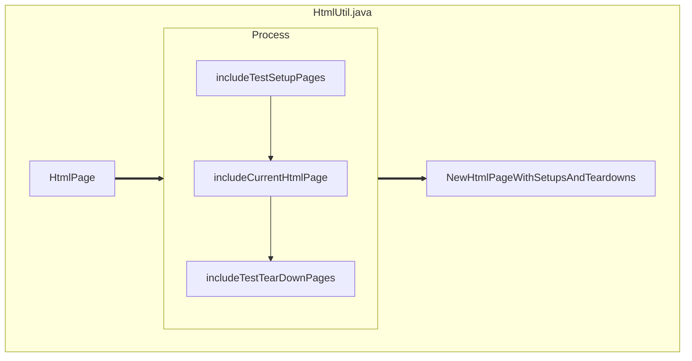

# FitNess Sample Codes
- [HtmlUtil.java](https://kingland.atlassian.net/wiki/spaces/~fralv%40ksd.kingland.cc/pages/123241624/Clean+Code+-+Function)

<!-- 
这是书中提供的样例代码，用于具体阐述书中的关于function的内容。
1. 给大家一分钟时间，你们可以快速的过一下书中的样例代码。可能有的同学已经看过书了，那也默默的再看一边。 看看在短时间内是否可以清楚，这段代码到底要做什么事情及大概怎么做的。

2. 为了方便大家理解代码，我可以额外提供一点信息关于Fitness这个框架
Fitness是一个集成测试框架。
Fitness本身就是一个Wiki系统，可以通过Wiki来管理我们的测试用例和展示测试结果，最后生成report的展示。 Wiki 是一个网上共同协作的超文本系统。

Fitness其中一部分就是wiki， 在页面上展示test case 和 test suit。

3. 有谁可以说一下你的理解，这段代码做了什么及大概怎么做的么。 第一次读这段代码的同学哈

4.即使有了这相关背景，我们也只是大概知道，好像是构建一个测试页面，但是我们还是很难在短时间内请了解清楚这其中的一些细节。

更何况当我们在对相关背景不太熟悉的情况下，阅读起来这样的代码会更加困难。

5. 我们一起读一下这段代码，这样有助于后面内容的理解。
...
1. 输入一个html page
2. 首先判断这是不是一个测试页面，如果不是什么都不做就返回
2. 是的话，继续。。。。

-->

---

<!-- 
其实这么一大坨的代码，也就是仅仅是完成了一件很简单的事情，就是输入一个测试页面，然后函数会给这个测试页面首尾分别加上setuppage和teardownpage，然后返回回去。

...
那按照上面图中的流程, 作者给我们做了一下简单的代码重构， 我们来看看效果
-->

---

- method name: testableHtml(PageData pageData) => renderPageWithSetupsAndTeardowns(PageData pageData)
- Only 3 steps to explain clearly what to do

<!-- 
这是重构后的代码，它都做了什么样的重构
1. 一是重新修改方法名字，以动词开头来清晰地表达它要做的事情。通过函数名字，我们就已经知道这个方法要做什么样的事情。
2. 二是那具体怎么做的呢？ 作者做了以下的优化：
  - 1. 将suitsetup和setup page的相关操作都重新定义到include
SetupPages()方法里， 
  - 2.. 将teardown和suitteardown page的相关操作都重新定义到了includeTeardownpages()
3. 这样在这个方法种，仅仅是通过简单的几步走，就可以清楚这个方法到底要做什么。这样它首先需要判断一下，这个页面是一个test page，然后，才需要去设置setup和teardown，否则什么都不做，原封不动的返回这个页面。
-->

---
layout: center
---

## How can we make a function communicate its intent？

 

## What attributes can help on this?

<!-- 
- 那么我们怎么能让函数方法清晰的表达它的意图
- 有什么样的属性可以帮助我们呢
-->
---
layout: center
---

- Rule 1: Small
- Rule 2: Do one thing
- Rule 3: One Level of Abstraction per Function
- Rule 4: Descriptive Function Name

Notes on reading:
- https://fluff-clam-4e7.notion.site/Clean-Code-0da06128f4a84954bdbf29f1a0767c3c

<!-- 
- 这是我们今天要讲的主要内容，small ***
- 同样提供了个人的读书笔记，快餐版， 建议是在已经读完书后有一定的理解后，再想快速浏览使用，而不是只看这个笔记，不读书。 快餐版是无法代替你在读书过程中自己的体会的。
-->