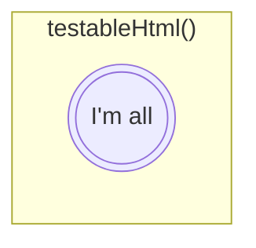

# Rule 2 - Do one thing
1. A function should only do one thing
2. What "one thing" is ?

---

## What "one thing" is ?

<!--
书中举出的例子是在最后重构好的代码中， 它有三个步骤：
1. 判断是否为测试页面
2. 如果是， 则进行setup and teardown的页面配置。
3. 渲染返回HTML页面。
那这个函数是完成一件事情还是完成了三件事情，大家思考一下。
下一页看答案
-->

---

> 👉 A function does only those steps that are one level below the stated name of function

 

> 👉 Team Building - https://frankie-talks-thinking.netlify.app/23

<!--
书中给出的概念是一个方法应该只做该函数名下同一抽象层上的步骤，那这个函数就只做了一件事情。
那按照这个概念的定义，书中最后重构后的方法是只做了一件事情。

对于我个人学习过程而已，这个解释很正确的，但是，如果给出书中样例代码之外的代码，对于准确地实践这个定义，还是有点含糊不清地，所以，我总结了一下个人的思考方式来将这个定义落地。 

所以，下面的内容是个人理解，仅供参考！！！

这部分是我之前分享过的关于结构化思考的部分，那次并不是全员分享的，有兴趣的可以后续再看看我的slides和笔记。
我认为对于能否将一个方法设计为足够小并且只做一件事情，首先，我们得对所实现的功能能有一个类似于这样的结构思考。我们要保证结构图中所有节点都尽可能地满足 MECE原则 - 相互独立，完全穷尽。 上次参加分享的，还有谁记得这个原则是什么？

这是举了一个例子关于如何组织我们的teambuilding， 假设，我们是要编写类似于结构图中的代码，我们需要思考如何编写相应的方法。 可以将每一个节点都理解为一个对应的方法。

那如何能实现一个方法只做一件事情，就是：
1. 这个方法不能去做同一层级的其他节点的事情，不要让他们有交集，有交集就以为不是一件事情，就意味在增加阅读负担。
2. 这个方法只包含它下一层也就是子节点的方法的调用，不能去包含孙子节点完成的事情。在书中的代码中， 最开始的方法就包含了所有所有子节点和孙子节点的所有事情，给我们的阅读增加了非常大的负担。
-->

---
layout: center
---

<!--
那么以这种思维方式，再回过头来看书中代码最开始的版本，从结构图中来看，就是所有层级的代码都混合再一起。

它没有不同层级level的划分，所以，它所带来的阅读负担，只要读过这些代码的就都可以体会的到。
-->
---
layout: center
---

<!--

将书中代码中的方法，以结构化的方式列出后，我们就可以很清晰的知道每个方法所处的层级。

讲解每个方法都是在做一件事情，因为每个方法都只是包含它的子层级的方法。

在这些方法中，中间层级的代码，我们都可以把他们理解为胶水代码，他们只是在同一层级的抽象，将整个流程串联起来，实际上它并没有真正的去完成需要做的事情，只有最底层的代码才是细节，才是要完成的事情。

还有一种快速检验你的方法是否足够小，是否只做一件事，就是像Nate叔说的，可以按照TDD的方式去思考，如果自己写junit test code来测试你这个方法，是否足够轻松和简单，否则，就得考虑是否方法不够好。

-->

