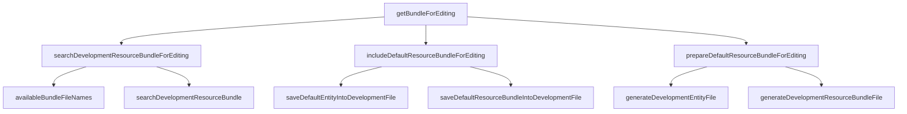

# Rule 2 - Do one thing
1. A function should only do one thing
2. What "one thing" is ?

---

## A function should only do one thing

- [public EditableResourceBundle getBundleForEditing(String name, Locale loc)](https://kingland.atlassian.net/wiki/spaces/~fralv%40ksd.kingland.cc/pages/123241624/Clean+Code+-+Function)

<!-- 
大家觉着我们重构后的代码，每个函数是只做了一件事情么。可以思考一下。。。

那怎么衡量，我们的一个函数是否只做了一件事情呢。
-->

---

## What "one thing" is ?

 

> 👉 A function does only those steps that are one level below the stated name of function

 

> 👉 Team Building - https://frankie-talks-thinking.netlify.app/23

---

# Sample - getBundleForEditing
 
 
 

<!--
    结合sample codes和结构图， 来一起看看实现的 Do one thing
-->
