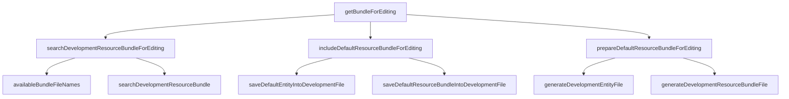

# Rule 3 - One Level of Abstraction per Function
1. Do not mix different level of abstraction within a function
2. Led you to the next in the compelling order

<!--
    刚才仅仅是说明了， 如何让一个函数只做一件事情，现在再深入的看一下，如何函数有一个更好的抽象层次的划分。
    我们需要注意两件事情。
-->
---

# Do not mix different level of abstraction within a function

 
 

---

> 👉 Team Building: https://frankie-talks-thinking.netlify.app/23

---

# Led you to the next in the compelling order

1. Stepdown rule
2. Peer sort

---

# Stepdown rule

US TV Series: 
- https://frankie-talks-thinking.netlify.app/19
- https://frankie-talks-thinking.netlify.app/20

---

# Peer sort

Sort:
https://frankie-talks-thinking.netlify.app/31
- time
- structure