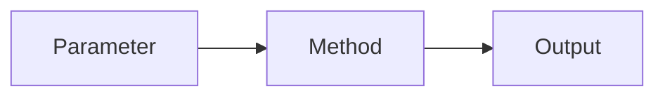
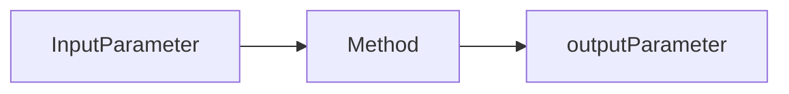

# Rule 5 - Function Arguments
   1. Monadic Function
   2. Dyadic Function
   3. Triads
   4. Flag Arguments
   5. Arugment Object
   6. Arugment List

---

public output method(parameter){}

public void method(inputParameter, outputParameter){}

---

# 1. Monadic Function

---

# 2. Dyadic Function

---

# 3. Triads

---

# 4. Flag Arguments

---

# 5. Arugment Object

---

# 6. Arugment List